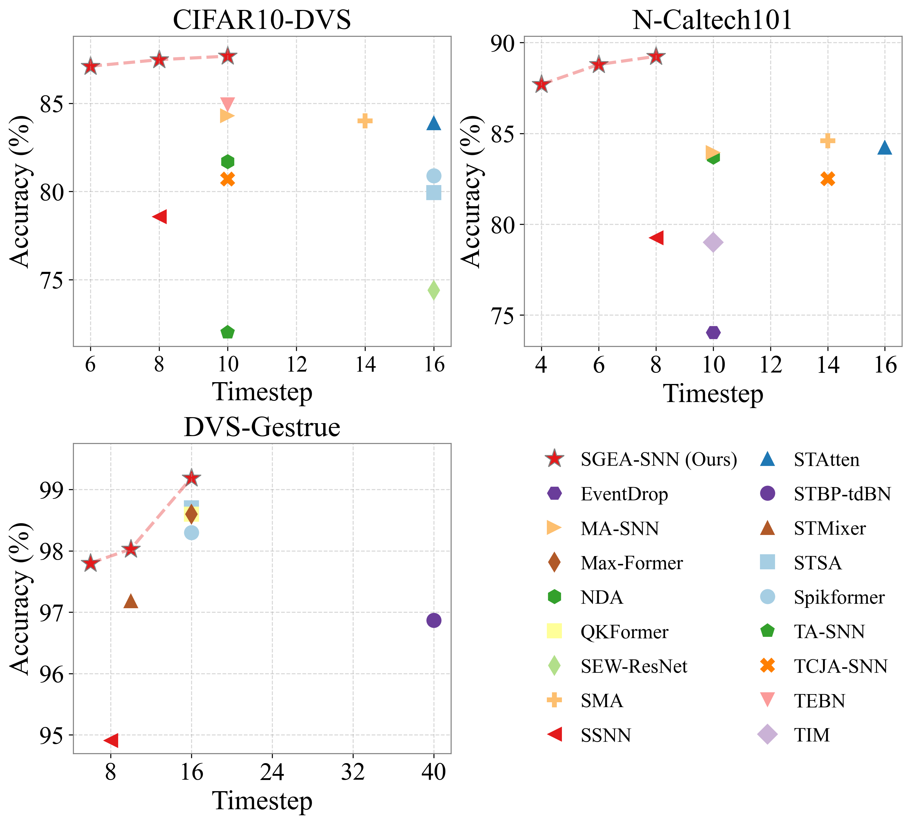

<h1>Rethinking Neuromorphic Object Recognition with Spiking Neural Networks</h1>

  

    Qing Yanga,d,
    Meiling Zhonga,d,
    Jiabin Suna,d,
    Jie Lia,d,
    Xiurong Zhonga,d,
    Shukai Duana,b,c,d,e,
    Lidan Wanga,b,c,d,e,*

    a College of Artificial Intelligence,
                Southwest University,
                Chongqing,
                400715,
                China&emsp;

    b State Key Laboratory of Intelligent Vehicle Safety Technology,
                Chongqing,
                401133,
                China&emsp;

    c National &amp; Local Joint Engineering Research Center of Intelligent Transmission and Control Technology,
                Chongqing,
                400715,
                China&emsp;

    d Chongqing Key Laboratory of Brain-inspired Computing and Intelligent Chips,
                Chongqing,
                400715,
                China&emsp;

    e Key Laboratory of Luminescence Analysis and Molecular Sensing (Southwest University), Ministry of Education,
                Chongqing,
                400715,
                China&emsp;

    * Corresponding author&emsp;

## News
* `Dec. 19, 2025` Create the GitHub repository for our paper.

## Comparison with the SOTA methods on neuromorphic datasets

  

## Prerequisites
- Python 3.9
- Pytorch 2.5.1
- Cuda 11.8
- spikingjelly 0.0.0.0.14

## Dataset download links
- CIFAR10-DVS: https://figshare.com/articles/dataset/CIFAR10-DVS_New/4724671
- N-Caltech101: https://www.garrickorchard.com/datasets/n-caltech101
- DVS-Gestrue: https://ibm.ent.box.com/s/3hiq58ww1pbbjrinh367ykfdf60xsfm8/folder/50167556794

## TODO

- [ ] If you have any questions, feel free to raise an issue or send a mail to `yangqing1227@qq.com`. I will respond to you as soon as possible.