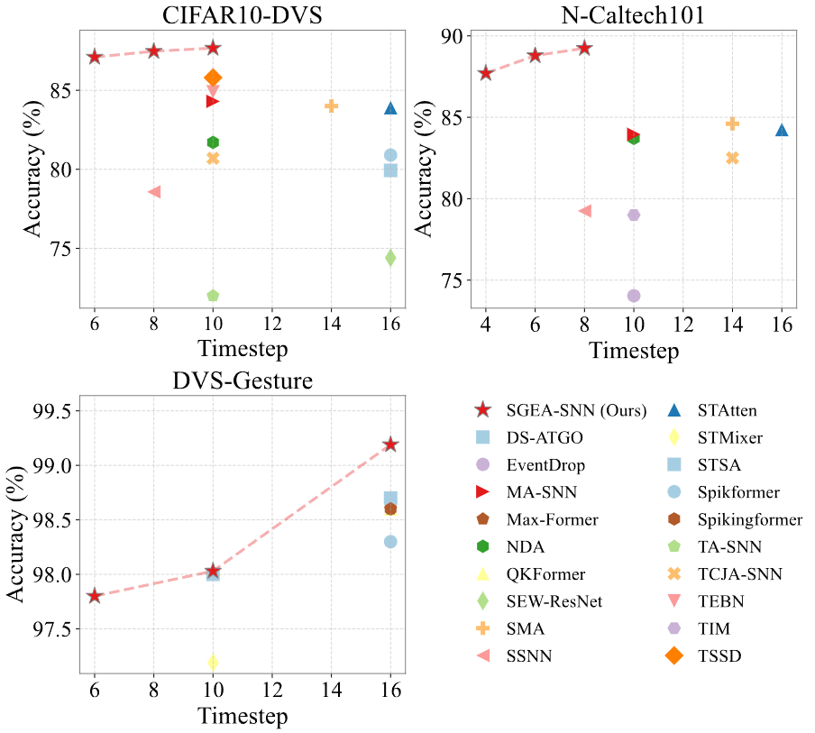

<h1>Spike-Gated Graph-Enhanced Attention for Energy-Efficient Neuromorphic Object Classification</h1>

  

    Qing Yanga,d,
    Meiling Zhonga,c,
    Jiabin Suna,c,
    Ziyan Fengb,
    Jie Lia,c,
    Xiurong Zhonga,c,
    Shukai Duana,c,d,e,f,
    Lidan Wanga,c,d,e,f,*

    a College of Artificial Intelligence,
                Southwest University,
                Chongqing,
                400715,
                China&emsp;

    b The Hong Kong University of Science and Technology (Guangzhou),
                Guangzhou,
                511453,
                China&emsp;

    c State Key Laboratory of Intelligent Vehicle Safety Technology,
                Chongqing,
                401133,
                China&emsp;

    d National &amp; Local Joint Engineering Research Center of Intelligent Transmission and Control Technology,
                Chongqing,
                400715,
                China&emsp;

    e Chongqing Key Laboratory of Brain-inspired Computing and Intelligent Chips,
                Chongqing,
                400715,
                China&emsp;

    f Key Laboratory of Luminescence Analysis and Molecular Sensing (Southwest University), Ministry of Education,
                Chongqing,
                400715,
                China&emsp;

    * Corresponding author&emsp;

## Performance comparison on neuromorphic datasets

  

## Prerequisites
- Python 3.9
- Pytorch 2.5.1
- Cuda 11.8
- Spikingjelly 0.0.0.0.14

## Dataset download links
- CIFAR10-DVS: https://figshare.com/articles/dataset/CIFAR10-DVS_New/4724671
- N-Caltech101: https://www.garrickorchard.com/datasets/n-caltech101
- DVS-Gestrue: https://ibm.ent.box.com/s/3hiq58ww1pbbjrinh367ykfdf60xsfm8/folder/50167556794

## Note

- [ ] The code will be released in stages. If you have any questions, feel free to send an email to `qingyangswu(AT)gmail DOT com`. I will respond to you as soon as possible. Let us work together to contribute to the development of spiking neural networks.

## Acknowledgments

- [ ] Chongqing Key Laboratory of Brain-inspired Computing and Intelligent Chips
- [ ] National & Local Joint Engineering Research Center of Intelligent Transmission and Control Technology